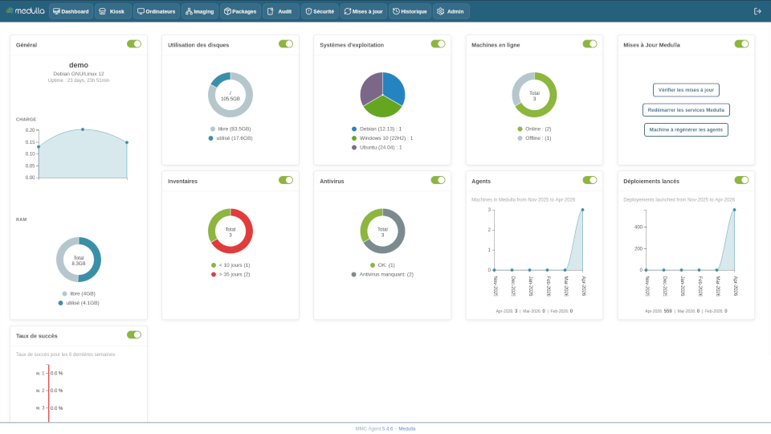

[English](README.md)
[Français](README.fr.md)

# Medulla RMM

Medulla est la solution RMM open source qui vous redonne la maîtrise complète de vos postes de travail. Grâce au protocole XMPP en temps réel, pilotez vos postes avec réactivité, sécurité et sans dépendance à un éditeur propriétaire.

## Clients fonctionnels

* Windows (à partir de la version 10 jusqu'aux dernières CBB et LTSB)
* Debian (12 bookworm)
* Ubuntu
* Zorin

(Support à venir pour Debian 13 et Android)

## Serveurs fonctionnels

* Debian (12 bookworm)

Les spécifications minimales sont détaillés dans la documentation :
https://docs.medulla-tech.io/books/medulla-installation-nlH/page/install-medulla-server-on-linux

## Fonctionnalités principales :

* Masterisation et multicast
  * Générateur de configuration système
  * Extraction et réinjection de pilotes
* Télé-déploiement
  * Assistant de packaging
  * Gestion de conformité
  * Remédiation automatique
  * Scan des CVE
* Inventaire (GLPI)
* Prise en main à distance (SSH, RDP, VNC via Apache Guacamole)
* Sauvegarde et restauration
* Gestion des mises à jour
* Kiosque applicatif

## Installation

Vous souhaitez tester Medulla ?
Nous proposons une version installable de Medulla pour évaluer la solution directement dans votre environnement.

Pour obtenir le fichier d’installation et recevoir les instructions de déploiement, faites votre demande ici :
https://medulla-tech.io/?ff_landing=18

Notre équipe est à votre disposition pour toute question ou demande de démonstration.

## Documentation

Lisez la [documentation](https://docs.medulla-tech.io/) 
